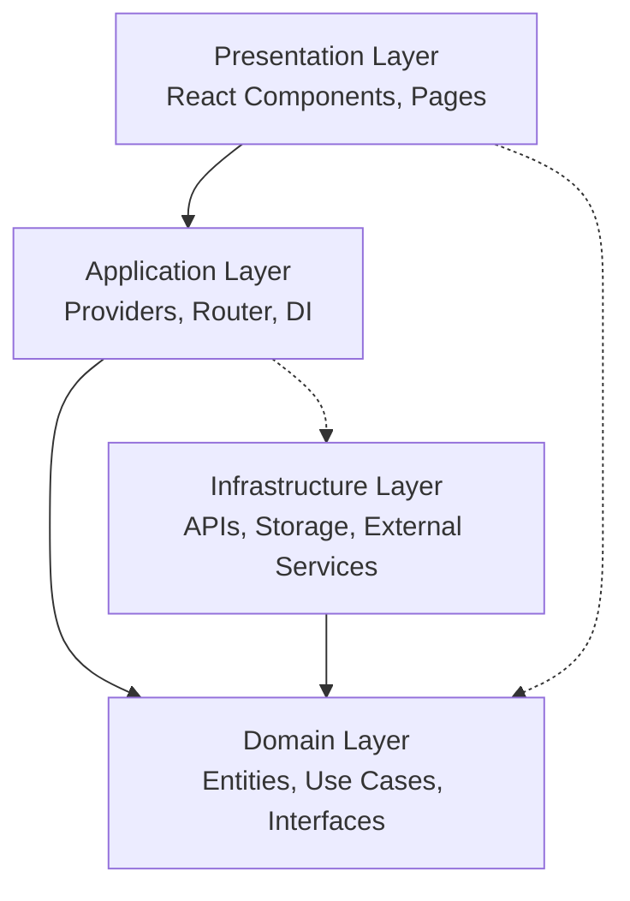

# Architektur-Dokumentation

## Clean Architecture Implementierung

Diese Dokumentation erklärt die Clean Architecture-Implementierung im React Template.

## Architektur-Übersicht



## Layer-Details

### 1. Domain Layer (Geschäftslogik)

**Zweck**: Enthält die reine Geschäftslogik, unabhängig von technischen Details.

**Komponenten**:
- **Entities**: Geschäftsobjekte mit Verhalten
- **Use Cases**: Anwendungsfälle und Geschäftsprozesse
- **Repository Interfaces**: Abstrakte Datenzugriffsdefinitionen

**Beispiel Entity**:
```typescript
export class User implements BaseEntity {
  private constructor(private readonly props: UserProps) {
    this.validateEmail(props.email)
  }

  public static create(props: CreateUserProps): User {
    return new User({
      ...props,
      id: crypto.randomUUID(),
      createdAt: new Date(),
      updatedAt: new Date(),
    })
  }

  public updateProfile(updates: UpdateUserData): User {
    return new User({
      ...this.props,
      ...updates,
      updatedAt: new Date(),
    })
  }

  // Geschäftsregeln hier implementiert
  public canLogin(): boolean {
    return this.props.isActive
  }
}
```

**Beispiel Use Case**:
```typescript
export class CreateUserUseCase {
  constructor(
    private readonly userRepository: UserRepository,
    private readonly passwordHasher: PasswordHasher,
    private readonly emailService: EmailService
  ) {}

  public async execute(input: CreateUserInput): Promise<Result<CreateUserOutput>> {
    // 1. Validierung
    // 2. Geschäftsregeln prüfen
    // 3. Entity erstellen
    // 4. Persistieren
    // 5. Side Effects (E-Mail senden)
  }
}
```

### 2. Infrastructure Layer (Technische Implementation)

**Zweck**: Implementiert technische Details und externe Abhängigkeiten.

**Komponenten**:
- **API Clients**: HTTP-Kommunikation
- **Repository Implementierungen**: Datenzugriff
- **External Services**: E-Mail, Authentifizierung, etc.
- **Storage Services**: LocalStorage, SessionStorage

**Beispiel Repository-Implementation**:
```typescript
export class UserApiRepository implements UserRepository {
  constructor(private readonly httpClient: HttpClient) {}

  public async findById(id: string): Promise<Result<User | null>> {
    try {
      const response = await this.httpClient.get<UserApiData>(`/users/${id}`)
      const user = this.mapApiDataToUser(response.data)
      return { success: true, data: user }
    } catch (error) {
      return { success: false, error }
    }
  }

  private mapApiDataToUser(data: UserApiData): User {
    return User.fromPersistence({
      // Mapping-Logik
    })
  }
}
```

### 3. Presentation Layer (UI)

**Zweck**: Benutzeroberfläche und Benutzerinteraktion.

**Komponenten**:
- **Components**: Wiederverwendbare UI-Elemente
- **Pages**: Vollständige Seitenkomponenten
- **Layouts**: Layout-Container
- **Hooks**: UI-spezifische Custom Hooks

**Beispiel Smart Component**:
```typescript
export function UserListPage(): JSX.Element {
  const listUsersUseCase = useListUsersUseCase()
  const [users, setUsers] = useState<User[]>([])
  const [loading, setLoading] = useState(true)

  useEffect(() => {
    const loadUsers = async () => {
      const result = await listUsersUseCase.execute({
        pagination: { page: 1, pageSize: 10 }
      })
      
      if (result.success) {
        setUsers(result.data.users.data)
      }
      setLoading(false)
    }
    
    loadUsers()
  }, [])

  return (
    <PageContainer title="Benutzer">
      {loading ? <LoadingSpinner /> : <UserList users={users} />}
    </PageContainer>
  )
}
```

### 4. Application Layer (Konfiguration)

**Zweck**: Verbindet alle Layer und konfiguriert die Anwendung.

**Komponenten**:
- **Providers**: Context-Provider für globalen State
- **Router**: Routing-Konfiguration
- **Dependency Injection**: Service-Container

**Beispiel Dependency Injection**:
```typescript
export function DependencyProvider({ children }: Props): JSX.Element {
  const dependencies = useMemo(() => {
    // 1. Services erstellen
    const httpClient = HttpClient.create()
    const passwordHasher = PasswordHasherFactory.createDefault()
    
    // 2. Repositories erstellen
    const userRepository = new UserApiRepository(httpClient)
    
    // 3. Use Cases erstellen
    const createUserUseCase = new CreateUserUseCase(
      userRepository,
      passwordHasher,
      emailService
    )
    
    return { createUserUseCase, userRepository }
  }, [])

  return (
    <DependencyContext.Provider value={dependencies}>
      {children}
    </DependencyContext.Provider>
  )
}
```

## Dependency Flow

### Abhängigkeitsregeln

1. **Inward Dependencies Only**: Äußere Layer dürfen innere Layer kennen, aber nicht umgekehrt
2. **Interface Segregation**: Dependencies werden über Interfaces definiert
3. **Dependency Inversion**: Konkrete Implementierungen werden injiziert

```typescript
// ❌ Falsch: Domain Layer importiert Infrastructure
import { UserApiRepository } from '@/infrastructure/api/UserApiRepository'

// ✅ Korrekt: Domain Layer definiert Interface
export interface UserRepository {
  findById(id: string): Promise<Result<User | null>>
}

// Infrastructure implementiert Domain Interface
export class UserApiRepository implements UserRepository {
  // Implementation
}
```

## SOLID Prinzipien in der Praxis

### Single Responsibility Principle

Jede Klasse hat nur einen Grund zur Änderung:

```typescript
// User Entity: Nur für User-Geschäftslogik
class User { /* ... */ }

// UserRepository: Nur für Datenzugriff  
interface UserRepository { /* ... */ }

// CreateUserUseCase: Nur für User-Erstellung
class CreateUserUseCase { /* ... */ }
```

### Open/Closed Principle

Offen für Erweiterung, geschlossen für Modifikation:

```typescript
// Interface definiert Kontrakt
interface EmailService {
  sendWelcomeEmail(email: string, name: string): Promise<void>
}

// Verschiedene Implementierungen möglich
class MockEmailService implements EmailService { /* ... */ }
class SendGridEmailService implements EmailService { /* ... */ }
class MailgunEmailService implements EmailService { /* ... */ }
```

### Liskov Substitution Principle

Implementierungen sind austauschbar:

```typescript
function createUser(
  userRepository: UserRepository,  // Interface
  emailService: EmailService      // Interface
) {
  // Funktioniert mit jeder konkreten Implementation
}
```

### Interface Segregation Principle

Kleine, fokussierte Interfaces:

```typescript
// ❌ Zu groß
interface UserService {
  create(): void
  update(): void
  delete(): void
  sendEmail(): void
  generateReport(): void
}

// ✅ Getrennte Verantwortlichkeiten
interface UserRepository { /* ... */ }
interface EmailService { /* ... */ }
interface ReportService { /* ... */ }
```

### Dependency Inversion Principle

Abhängigkeit von Abstraktionen:

```typescript
// ✅ Use Case hängt von Interface ab, nicht von Implementierung
class CreateUserUseCase {
  constructor(
    private readonly userRepository: UserRepository,  // Interface
    private readonly emailService: EmailService       // Interface
  ) {}
}

// Konkrete Implementierungen werden injiziert
const createUserUseCase = new CreateUserUseCase(
  new UserApiRepository(httpClient),
  new MockEmailService()
)
```

## Testing-Strategie

### Unit Tests (Domain Layer)

```typescript
describe('User Entity', () => {
  it('should validate business rules', () => {
    expect(() => User.create({ email: 'invalid' }))
      .toThrow(ValidationError)
  })
})

describe('CreateUserUseCase', () => {
  it('should create user and send welcome email', async () => {
    const mockRepository = createMockUserRepository()
    const mockEmailService = createMockEmailService()
    
    const useCase = new CreateUserUseCase(mockRepository, mockEmailService)
    const result = await useCase.execute(validInput)
    
    expect(result.success).toBe(true)
    expect(mockEmailService.sendWelcomeEmail).toHaveBeenCalled()
  })
})
```

### Integration Tests (Infrastructure Layer)

```typescript
describe('UserApiRepository', () => {
  it('should map API data to domain entities', async () => {
    const httpClient = new MockHttpClient()
    const repository = new UserApiRepository(httpClient)
    
    const result = await repository.findById('123')
    
    expect(result.success).toBe(true)
    expect(result.data).toBeInstanceOf(User)
  })
})
```

### Component Tests (Presentation Layer)

```typescript
describe('UserListPage', () => {
  it('should display users from use case', async () => {
    const mockUseCase = createMockListUsersUseCase()
    
    render(
      <DependencyProvider overrides={{ listUsersUseCase: mockUseCase }}>
        <UserListPage />
      </DependencyProvider>
    )
    
    await waitFor(() => {
      expect(screen.getByText('John Doe')).toBeInTheDocument()
    })
  })
})
```

## Performance-Optimierungen

### Code Splitting

```typescript
// Lazy Loading von Pages
const HomePage = React.lazy(() => import('@/presentation/pages/HomePage'))
const AboutPage = React.lazy(() => import('@/presentation/pages/AboutPage'))

// Route-basiertes Code Splitting
<Route path="/" element={
  <Suspense fallback={<LoadingSpinner />}>
    <HomePage />
  </Suspense>
} />
```

### Memoization

```typescript
// Entity-Berechnungen memoized
export class User {
  private _fullName?: string

  public get fullName(): string {
    if (!this._fullName) {
      this._fullName = `${this.firstName} ${this.lastName}`
    }
    return this._fullName
  }
}

// React Components memoized
export const UserCard = React.memo(({ user }: { user: User }) => {
  return <div>{user.fullName}</div>
})
```

### Bundle-Optimierung

```typescript
// Tree Shaking durch Barrel Exports
export * from './User'
export * from './Product'

// Dynamic Imports für große Libraries
const heavyLibrary = await import('heavy-library')
```

## Error Handling

### Domain-Fehler

```typescript
export class DomainError extends Error {
  constructor(
    message: string,
    public readonly code: string,
    public readonly context?: Record<string, unknown>
  ) {
    super(message)
    this.name = 'DomainError'
  }
}

export class ValidationError extends DomainError {
  constructor(message: string, field: string) {
    super(message, 'VALIDATION_ERROR', { field })
  }
}
```

### Result Pattern

```typescript
export type Result<T, E = Error> = 
  | { success: true; data: T }
  | { success: false; error: E }

// Usage
const result = await userRepository.findById('123')
if (result.success) {
  console.log(result.data.fullName)
} else {
  console.error(result.error.message)
}
```

### Error Boundaries

```typescript
export class ErrorBoundary extends Component {
  public componentDidCatch(error: Error, errorInfo: ErrorInfo) {
    console.error('Error caught by boundary:', error, errorInfo)
    // Send to error tracking service
  }

  public render() {
    if (this.state.hasError) {
      return <ErrorFallback />
    }
    return this.props.children
  }
}
```

## Migration Guide

### Von bestehenden Projekten

1. **Schritt 1**: Domain Layer extrahieren
2. **Schritt 2**: Repository Pattern einführen
3. **Schritt 3**: Use Cases implementieren
4. **Schritt 4**: Dependency Injection setup
5. **Schritt 5**: UI von Domain entkoppeln

### Schrittweise Einführung

```typescript
// Phase 1: Repository Pattern
interface UserService {
  getUsers(): Promise<User[]>
}

// Phase 2: Use Cases
class GetUsersUseCase {
  constructor(private userService: UserService) {}
  execute(): Promise<User[]> { /* ... */ }
}

// Phase 3: Dependency Injection
function App() {
  return (
    <ServiceProvider>
      <UserList />
    </ServiceProvider>
  )
}
```

## Best Practices

### Do's ✅

- **Domain-first Design**: Beginne mit Geschäftslogik
- **Interface-driven Development**: Definiere Interfaces vor Implementierung
- **Dependency Injection**: Verwende Constructor Injection
- **Result Pattern**: Explizites Error Handling
- **Immutable Entities**: Entities als unveränderliche Objekte
- **Single Purpose**: Eine Verantwortlichkeit pro Klasse

### Don'ts ❌

- **Keine Business Logic in UI**: Komponenten sollten nur UI-Logik enthalten
- **Keine Direct API Calls**: Immer über Repository Pattern
- **Keine Tight Coupling**: Layer sollten austauschbar sein
- **Keine God Objects**: Große, alles-könnende Klassen vermeiden
- **Keine Shared State**: Globaler State nur wo nötig
- **Keine Deep Hierarchies**: Flache Strukturen bevorzugen

---

Diese Architektur gewährleistet wartbaren, testbaren und erweiterbaren Code für langfristige Projekte.
